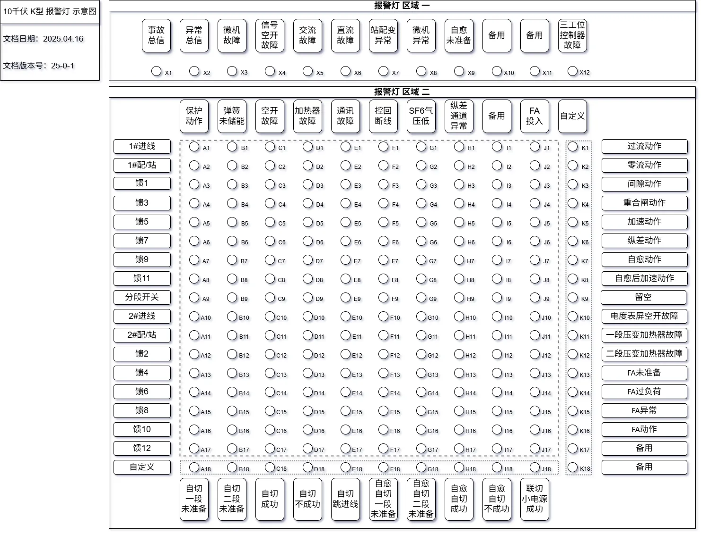

# 10千伏 K型 报警灯配置表

::: tip 文档版本

> **`更新日期：2024.09.11`**

> **`文档版本号：24-0-3`**

:::

------

::: tip 文档目录 

[[TOC]]

:::

------

::: warning 重要提示

📣📣📣 <！--重要提示，请务必阅读--！>📣📣📣

- 事故总信、异常总信
  - 事故总信：为本站所有 保护动作 的合成量，并且亮灯为保持，需手动复归。
  - 异常总信：为本站所有 异常类 型号的合成量，并且亮灯为自动复归。
- 保护动作 亮灯说明
  - 各合成类保护动作信亮灯时，同时点亮对应仓位保护动作灯。
  - 举例：1#进线纵差保护动作时，跳开 1#进线开关（*此时点亮 K5 及 A1 表示1#进线由纵差保护跳闸*）。
  - 举例：分段自切动作时，跳开 1#进线开关（*此时点亮 A1 及 E18 表示1#进线通过自切跳闸*），合上分段开关（*此时点亮 C18 表示为分段开关合闸成功*）。

- 各合成信号详见 报警灯 区域一、报警灯 区域二 信号构成说明。

- 仓位名称应使用高压柜线路名称全称。

- 如有自愈或FA功能，请提供对应的拓扑图，并且打印塑封后粘贴于后台装置旁。

- 使用标签贴纸，把 *各隔间的定义名称* 与 *线路名称* 对应。如： ***JG1：金1***

:::

## 报警灯 灯位对应表

#### 报警灯  示意图

## 报警灯 区域一  信号源详解

>- ##### X1	事故总信（手动复归）
>
>> - 出线保护动作（合成）
>> - 自切成功（合成）
>> - 自切不成功（合成）
>> - 自切跳进线（合成）
>> - 自切连跳小电源仓位（合成）
>> - 自愈动作（合成）
>> - 自愈后加速动作（合成）
>> - 自愈自切动作（合成）
>> - 自愈自切不动作（合成）
>> - 自愈自切跳闸成功（合成）
>> - 自愈自切连跳小电源仓位（合成）
>> - FA动作（合成）

>- ##### X2	异常总信（自动复归）
>
>>- 保护装置失电
>>- 保护装置异常
>>- 保护装置通讯故障
>>- 信号空开故障
>>- 空开故障
>>- 交流屏故障
>>- 直流屏故障
>>- 站配变异常
>>- 三工位控制器故障
>>- 自愈未准备
>>- 加热器故障
>>- 控制回路断线
>>- 弹簧未储能
>>- SF6气压低
>>- 纵差通道故障
>>- 自切未准备
>>- 自愈未准备
>>- 自愈自切未准备
>>- FA未准备
>>- FA异常
>>- FA过负荷

>- ##### X3	保护装置失电
>
>>- 站内所有保护装置失电（硬开入）

>- ##### X4	信号空开故障
>
>>- 站内所有信号空开故障（硬开入）

>- ##### X5	交流屏故障
>
>>- 交流屏故障（硬开入）
>>- 交流进线失电（硬开入）

>- ##### X6	直流屏故障
>
>>- 直流装置故障（硬开入）
>>- 直流进线失电（硬开入）

>- ##### X7	站配变异常
>
>>- 站用变熔丝熔断（硬开入）
>>- 配变温度高（硬开入/遥信开入）

>- ##### X8	保护装置异常
>
>>- 站内所有保护装置异常（硬开入）

>- ##### X9	自愈未准备
>
>>- 自愈保护已充电（取反信号）（软信号）
>
>- ##### X10	备用
>
>- ##### X11	备用
>
>- ##### X12	三工位控制器故障

------

## 报警灯 区域二 信号源详解

> - ##### A1~A17	保护动作
>
> > - 过流I、II、III动作
> > - 零流I、零流II动作
> > - 过流反时限动作
> > - 零流反时限动作
> > - 过流加速动作
> > - 零流加速动作
> > - 间隙接地动作
> > - 纵差保护动作
> > - 重合闸动作
> > - 自切动作（按站内实际情况）
> > - 自切跳小电源动作（按站内实际情况）
> > - 自愈动作（按站内实际情况）
> > - 自愈后加速动作（按站内实际情况）
> > - 自愈自切动作（按站内实际情况）
> > - 自愈自切跳小电源动作（按站内实际情况）
> > - FA动作（按站内实际情况）

> - ##### B1~B17	弹簧未储能
>>- 对应开关未储能信号(软信号)

> - ##### C1~C17	空开故障
>>- 对应仓位空开故障信号(遥信开入)

> - ##### D1~D17	加热器故障
>>- 对应仓位加热器故障信号(遥信开入)

> - ##### E1~E17	通讯故障
>>- 对应仓位保护装置通讯故障信号(软信号)

> - ##### F1~F17	控回断线
>>- 对应仓位控制回路断线信号(软信号)

> - ##### G1~G17	SF6气压低
>>- 对应仓位SF6充气型开关柜气压低信号 (遥信开入)

> - ##### H1~H17	纵差通道故障
>>- 对应纵差保护装置 纵差通道故障信号(软信号/硬开入)

> - ##### I1~I17	备用
>>- 备用

> - ##### J1~J17	FA投入
> >- 各串FA功能投入(软信号)
----
> - ##### A18	自切一段未准备
>>- 10千伏一段 自切未准备信号(软信号)

> - ##### B18	自切二段未准备
>>- 10千伏二段 自切未准备信号(软信号)

> - ##### C18	自切成功
>>-  自切 合 分段开关

> - ##### D18	自切不成功
>>-  自切 后加速 跳 分段开关

> - ##### E18	自切跳进线
> >-  自切跳1#进线开关
> >-  自切跳2#进线开关

> - ##### F18	自愈自切一段未准备
>>-  A串自愈自切未准备（软信号

> - ##### G18	自愈自切二段未准备
>>-  B串自愈自切未准备（软信号）

> - ##### H18	自愈自切成功
>>-  自愈自切 合 分段开关

> - ##### I18	自愈自切不成功
>>-  自愈自切 后加速 跳 分段开关

> - ##### J18	连跳小电源成功
> >- 自切连跳小电源仓位
> >- 自愈自切连跳小电源仓位
----
> - ##### K1	过流动作
>
> >   - 所有仓位 过流I、II、III动作
> >   - 所有仓位 过流反时限动作
>
> - ##### K2	零流动作
>
> > - 所有仓位 零流I、零流II动作
> > - 所有仓位 零流反时限动作
>
> - ##### K3	间隙动作
>
> > - 所有仓位 间隙接地动作
>
> - ##### K4	重合闸动作
>
> > - 所有仓位 重合闸动作
>
> - ##### K5	加速动作
>
> > - 所有仓位 过流前加速保护动作
> > - 所有仓位 零流前加速保护动作
> > - 所有仓位 过流后加速保护动作
> > - 所有仓位 零流后加速保护动作
>
> - ##### K6	纵差动作
>
> > - 所有仓位 纵差保护动作
>
> - ##### K7	自愈动作
>
> > - A串 自愈动作（硬开入）
> > - B串 自愈动作（硬开入）
> > - A串 自愈保护动作（软信号）
> > - B串 自愈保护动作（软信号）
>
> - ##### K8	自愈后加速动作
>
> > - A串 自愈过流后加速动作（软信号）
> > - A串 自愈零流后加速动作（软信号）
> > - B串 自愈过流后加速动作（软信号）
> > - B串 自愈零流后加速动作（软信号）
>
> - ##### K9	留空
>
> > - 留空
>
> - ##### K10	电度表屏空开故障
>
> > - 电度表屏一 空开故障信号
> >
> > - 电度表屏二 空开故障信号
>
> - ##### K11	一段压变加热器故障
>
> - ##### K12	二段压变加热器故障
>
> - ##### K13	FA未准备
>
> > - FA功能逻辑判定未准备（软信号）
>
> - ##### K14	FA过负荷
>
> > - FA环路负荷越限（软信号）
>
> - ##### K15	FA异常
>
> > - FA装置异常（软信号）
>
> - ##### K16	FA动作
>
> > - FA环路 所属仓位 FA动作信号
>
> - ##### K17	备用
>
> - ##### K18	备用

------

## 联系方式

------

> ### 金山继保 内部文件，禁止外传
>
> ### 如有疑问，请联系 18918632300 顾

------

## 更新说明

[2024.09.11]	

新增 连跳小电源 (J18) 报警灯 

新增 自愈自切不成功 (I18) 报警灯 

[2024.09.03]	

新增 加速动作 (K5) 报警灯 

调整 纵差动作 (K6) 报警灯 

调整 FA动作 (K16) 报警灯

[2024.08.02]	

报警灯 亮灯 细化
