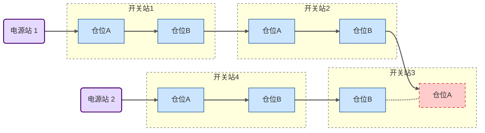

# 自愈环路链路图

```mermaid
graph LR
    %% 从左到右布局，PS1 在左侧，PS2 在右侧
    PS1(电源站 1) -->| | SS1A

    %% 开关站 1
    subgraph 开关站1
        SS1A[仓位A] --> SS1B[仓位B]
    end
    SS1B -->| | SS2A

    %% 开关站 2
    subgraph 开关站2
        SS2A[仓位A] --> SS2B[仓位B]
    end
    SS2B -->| | SS3A

    %% 开关站 3 - 开环点
    subgraph 开关站3
        SS3A[仓位A] -.- SS3B[仓位B]
    end
    SS3B -->| | SS4A

    %% 开关站 4
    subgraph 开关站4
        SS4A[仓位A] --> SS4B[仓位B]
    end
    SS4B -->| | PS2(电源站 2)

    %% 样式优化
    style PS1 fill:#e6d9ff,stroke:#4a0072,stroke-width:2px
    style PS2 fill:#e6d9ff,stroke:#4a0072,stroke-width:2px
    style SS1A fill:#cce5ff,stroke:#004085,stroke-width:1px
    style SS1B fill:#cce5ff,stroke:#004085,stroke-width:1px
    style SS2A fill:#cce5ff,stroke:#004085,stroke-width:1px
    style SS2B fill:#cce5ff,stroke:#004085,stroke-width:1px
    style SS3A fill:#ffcccc,stroke:#cc0000,stroke-width:1px,stroke-dasharray:5,5
    style SS3B fill:#cce5ff,stroke:#004085,stroke-width:1px
    style SS4A fill:#cce5ff,stroke:#004085,stroke-width:1px
    style SS4B fill:#cce5ff,stroke:#004085,stroke-width:1px

    style 开关站1 stroke:#666666,stroke-width:1px,stroke-dasharray:4,4
    style 开关站2 stroke:#666666,stroke-width:1px,stroke-dasharray:4,4
    style 开关站3 stroke:#666666,stroke-width:1px,stroke-dasharray:4,4
    style 开关站4 stroke:#666666,stroke-width:1px,stroke-dasharray:4,4

    %% 调整箭头样式，避免遮挡
    linkStyle default stroke:#555555,stroke-width:2px
```

# 10kV 自愈环路链路图

```mermaid
graph LR
    %% 从左到右布局，PS1 在左侧，PS2 在右侧
    PS1(电源站 1) -->| | SS1A

    %% 开关站 1
    subgraph 开关站1
        SS1A[仓位A] --> SS1B[仓位B]
    end
    SS1B -->| | SS2A

    %% 开关站 2
    subgraph 开关站2
        SS2A[仓位A] --> SS2B[仓位B]
    end
    SS2B -->| | SS3A

    %% 开关站 3 - 开环点
    subgraph 开关站3
        %% 修正为虚线，表示开环点
        SS3B[仓位B] -.- SS3A[仓位A]
    end
    SS4A -->| | SS3B

    %% 开关站 4
    subgraph 开关站4
        SS4B[仓位A] --> SS4A[仓位B]
    end
    PS2(电源站 2) -->| | SS4B

    %% 样式优化
    style PS1 fill:#e6d9ff,stroke:#4a0072,stroke-width:2px
    style PS2 fill:#e6d9ff,stroke:#4a0072,stroke-width:2px
    style SS1A fill:#cce5ff,stroke:#004085,stroke-width:1px
    style SS1B fill:#cce5ff,stroke:#004085,stroke-width:1px
    style SS2A fill:#cce5ff,stroke:#004085,stroke-width:1px
    style SS2B fill:#cce5ff,stroke:#004085,stroke-width:1px
    style SS3A fill:#ffcccc,stroke:#cc0000,stroke-width:1px,stroke-dasharray:5,5
    style SS3B fill:#cce5ff,stroke:#004085,stroke-width:1px
    style SS4A fill:#cce5ff,stroke:#004085,stroke-width:1px
    style SS4B fill:#cce5ff,stroke:#004085,stroke-width:1px

    style 开关站1 stroke:#666666,stroke-width:1px,stroke-dasharray:4,4
    style 开关站2 stroke:#666666,stroke-width:1px,stroke-dasharray:4,4
    style 开关站3 stroke:#666666,stroke-width:1px,stroke-dasharray:4,4
    style 开关站4 stroke:#666666,stroke-width:1px,stroke-dasharray:4,4

    %% 调整箭头样式，避免遮挡并优化对齐
    linkStyle default stroke:#555555,stroke-width:2px
```