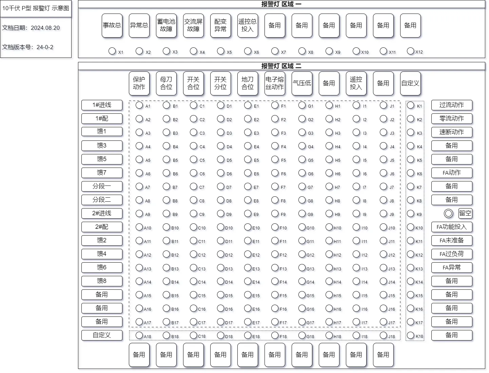

# 10千伏 P型 报警灯配置表

::: tip 文档版本

> **`更新日期：2024.08.20`**

> **`文档版本号：24-0-3`**

:::

------

::: tip 文档目录 

[[TOC]]

:::

------

::: warning 重要提示

📣📣📣 <！--重要提示，请务必阅读--！>📣📣📣

- 事故总信、异常总信
  - 事故总信：为本站所有 保护动作 的合成量，并且亮灯为保持，需手动复归。
  - 异常总信：为本站所有 异常类 型号的合成量，并且亮灯为自动复归。
- 保护动作 亮灯说明
  - 各合成类保护动作信亮灯时，同时点亮对应仓位保护动作灯。
    - 举例：1#进线保护动作时，跳开 1#进线开关（*此时点亮 K1 及 A1 表示1#进线由过流保护跳闸*）。
    - 举例：1#进线FA动作时，跳开 1#进线开关（*此时点亮 K6 及 A1 表示1#进线由FA动作跳闸*）。
- 各合成信号详见 报警灯 区域一、报警灯 区域二 信号构成说明。
- 线路间隔定义
  - 线路间隔名称为 10千伏仓位名称全称。
  - ***航插按照报警灯排序依次接入。***
    - 举例：***“线路一”，接入 1#进线航插；“线路二”，接入1#配变航插；“线路三”，接入馈1航插。***

:::

## 报警灯 灯位对应表

#### 报警灯  示意图

## 报警灯 区域一  信号源详解

>- #### X1	事故总信
>
>> - 各仓位 保护动作（合成）
>> - 对应仓位 FA动作（合成）
>> - 对应仓位 电子熔丝动作（合成）

>- ##### X2	异常总信
>
>>- 交流屏故障
>>- 蓄电池故障故障
>>- 配变异常
>>- 气压低
>>- FA未准备
>>- FA异常
>>- FA过负荷

>- ##### X3	交流屏故障
>
>>- 交流失电
>>- 交流ATS装置异常

>- ##### X4	蓄电池故障
>
>>- 蓄电池组故障

>- ##### X5	配变异常
>
>>- 配变温度高

>- ##### X6	备用
>

>- ##### X7	备用
>

>- ##### X8	备用
>

>- ##### X9	备用
>
>- ##### X10	备用
>
>- ##### X11	备用
>
>- ##### X12	备用

------

## 报警灯 区域二 信号源详解

> - ##### A1~A17	保护动作
>
> > - 过流动作
> > - 零流动作
> > - 前加速动作
> > - FA动作（按站内实际情况）

> - ##### B1~B17	母刀合位

> - ##### C1~C17	开关合位

> - ##### D1~D17	开关分位

> - ##### E1~E17	地刀合位

> - ##### F1~F17	电子熔丝动作
>>- 对应仓位 电子熔丝信号

> - ##### G1~G17	气压低
>>- 对应仓位 气压低信号

> - ##### H1~H17	备用

> - ##### I1~I17	遥控投入

> - ##### J1~J17	备用
----
> - ##### A18~K18	自定义信号 

----
> - ##### K1	过流动作
>
> - ##### K2	零流动作
>
> - ##### K3	速断动作
>
> - ##### K4	备用
>
> - ##### K5	备用
>
> - ##### K6	FA动作
>
> - ##### K7	备用
>
> - ##### K8	备用
>
> - ##### K9	留空
>
> - ##### K10	备用
>
> - ##### K11	备用
>
> - ##### K12	FA未准备
>
> - ##### K13	FA过负荷
>
> - ##### K14	FA异常
>
> - ##### K15	备用
>
> - ##### K16	备用
>
> - ##### K17	备用
>
> - ##### K18	备用

------

## 联系方式

------

> ### 金山继保 内部文件，禁止外传
>
> ### 如有疑问，请联系 18918632300 顾

------

#### 更新说明

[2024.08.20]	取消 各仓位FA投入报警灯

[2024.07.11]	新增 P型站报警灯配置

[2024.07.11]	新增 母线闸刀、接地闸刀 报警灯
