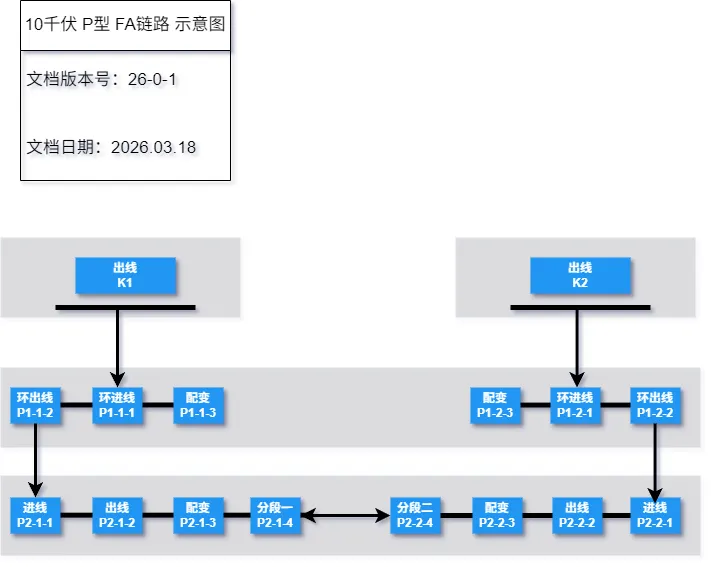

# 10千伏 P型 FA链路故障表

::: tip 文档版本

> **`更新日期：2026.03.18`**

> **`文档版本号：26-0-1`**

:::

------

::: tip 文档目录 

[[TOC]]

:::

------

::: warning 重要提示

📣📣📣 <！--重要提示，请务必阅读--！>📣📣📣

- 事故总信、异常总信
  - 事故总信：为本站所有 保护动作 的合成量，并且亮灯为保持，需手动复归。
  - 异常总信：为本站所有 异常类 型号的合成量，并且亮灯为自动复归。
- 保护动作 亮灯说明
  - 各合成类保护动作信亮灯时，同时点亮对应仓位保护动作灯。
    - 举例：1#进线保护动作时，跳开 1#进线开关（*此时点亮 K1 及 A1 表示1#进线由过流保护跳闸*）。
    - 举例：1#进线FA动作时，跳开 1#进线开关（*此时点亮 K6 及 A1 表示1#进线由FA动作跳闸*）。
- 各合成信号详见 报警灯 区域一、报警灯 区域二 信号构成说明。
- 线路间隔定义
  - 线路间隔名称为 10千伏仓位名称全称。
  - ***航插按照报警灯排序依次接入。***
    - 举例：***“线路一”，接入 1#进线航插；“线路二”，接入1#配变航插；“线路三”，接入馈1航插。***

:::

## 报警灯 灯位对应表

#### 报警灯  示意图

## 典型故障动作行为

>- ##### 故障一	开关站 至 1P站 线路故障
>
>> 1. K1 保护动作
>> 2. 跳 K1 开关
>> 3. 跳 P1-1-1 开关
>> 4. 合 P2-2-4 开关

>- ##### 故障二	1P站 母线故障
>
>>1. K1 保护动作
>>2. 跳 K1 开关
>>3. 跳 P1-1-1 开关
>>4. 跳 P1-1-2 开关
>>5. 合 K1 开关
>>6. 合 P2-2-4 开关

>- ##### 故障三	1P站 至 2P站 线路故障
>
>>- K1 保护动作
>>- 跳 K1 开关
>>- 跳 P1-1-2 开关
>>- 跳 P2-1-1 开关
>>- 合 K1 开关
>>- 合 P2-2-4 开关

>- ##### 故障四	1P站 出线 线路故障
>
>>- K1 保护动作
>>- 跳 K1 开关
>>- 跳 P1-1-3 开关
>>- 合 K1 开关

>- ##### 故障五	1P站 遥控闭锁 故障
>
>>- K1 保护动作
>>- 跳 K1 开关
>>- 遥控闭锁 跳 P1-1-3 开关
>>- FA闭锁

>- ##### 故障六	2K站 线路故障
>
>>- K1 保护动作
>>- 跳 K1 开关
>>- 跳 P1-1-2 开关
>>- 跳 P2-1-1 开关
>>- 合 K1 开关

>- ##### 故障七	2K站 负载均分
>>- K1 保护动作
>>- 跳 K1 开关
>>- 跳 P1-1-1 开关
>>- 合 K1 开关
>

>- ##### 故障八	1K站 开关拒动
>>- K1 保护动作
>>- 拒跳 K1 开关
>>- 跳 P1-1-1 开关
>>- 合 K1 开关
>>- 合 P2-2-4 开关
>

>- ##### 故障九	2P站 开环点母线故障
>>- K1 保护动作
>>- 跳 K1 开关
>>- 跳 P2-2-1 开关
>>- 跳 P2-1-4 开关
>>- 合 K1 开关
>
>- ##### X8	备用
>

>- ##### X9	备用
>
>- ##### X10	备用
>
>- ##### X11	备用
>
>- ##### X12	

## 联系方式

------

> ### 金山继保 内部文件，禁止外传
>
> ### 如有疑问，请联系 18918632300 顾

------

## 更新说明

[2024.08.20]	取消 各仓位FA投入报警灯

[2024.07.11]	新增 P型站报警灯配置

[2024.07.11]	新增 母线闸刀、接地闸刀 报警灯
