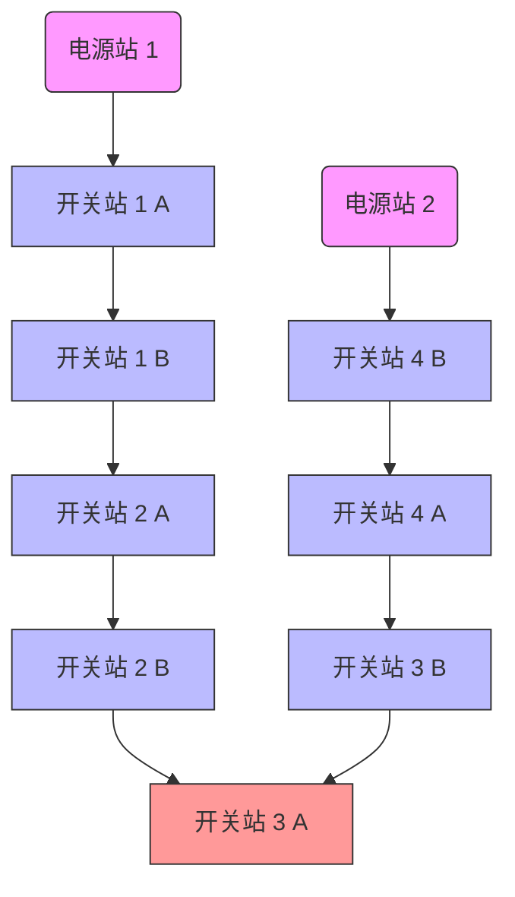
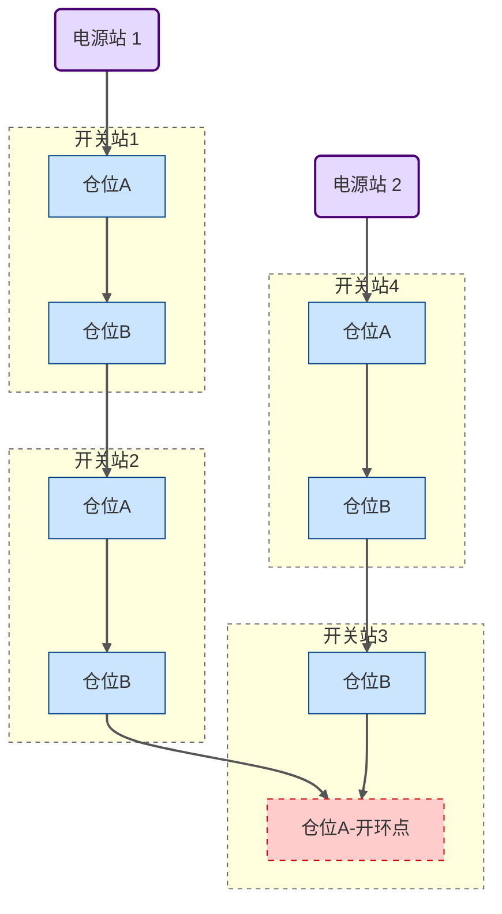

---
111
---

# TEST 测试




# 10kV 自愈环路链路图


# 10kV 自愈环路链路图

```mermaid
graph TD
    %% 电源站水平对齐
    subgraph 电源站
        PS1(电源站 1) -.- PS2(电源站 2)  %% 使用虚线并排放置，强制水平
    end

    %% 开关站 1
    PS1 -->| | SS1A
    subgraph 开关站1
        SS1A[仓位A] --> SS1B[仓位B]
    end
    SS1B -->| | SS2A

    %% 开关站 2
    subgraph 开关站2
        SS2A[仓位A] --> SS2B[仓位B]
    end
    SS2B -->| | SS3A

    %% 开关站 3 - 开环点
    subgraph 开关站3
        SS3A[仓位A-开环点] -.- SS3B[仓位B]  %% 虚线表示开环点，调整顺序
    end
    SS4A -->| | SS3B  %% 从底部进入 SS3B

    %% 开关站 4
    subgraph 开关站4
        SS4B[仓位A] --> SS4A[仓位B]
    end
    PS2 -->| | SS4B

    %% 样式优化
    style PS1 fill:#e6d9ff,stroke:#4a0072,stroke-width:2px
    style PS2 fill:#e6d9ff,stroke:#4a0072,stroke-width:2px
    style SS1A fill:#cce5ff,stroke:#004085,stroke-width:1px
    style SS1B fill:#cce5ff,stroke:#004085,stroke-width:1px
    style SS2A fill:#cce5ff,stroke:#004085,stroke-width:1px
    style SS2B fill:#cce5ff,stroke:#004085,stroke-width:1px
    style SS3A fill:#ffcccc,stroke:#cc0000,stroke-width:1px,stroke-dasharray:5,5
    style SS3B fill:#cce5ff,stroke:#004085,stroke-width:1px
    style SS4A fill:#cce5ff,stroke:#004085,stroke-width:1px
    style SS4B fill:#cce5ff,stroke:#004085,stroke-width:1px

    style 开关站1 stroke:#666666,stroke-width:1px,stroke-dasharray:4,4
    style 开关站2 stroke:#666666,stroke-width:1px,stroke-dasharray:4,4
    style 开关站3 stroke:#666666,stroke-width:1px,stroke-dasharray:4,4
    style 开关站4 stroke:#666666,stroke-width:1px,stroke-dasharray:4,4
    style 电源站 stroke:#666666,stroke-width:1px,stroke-dasharray:4,4

    %% 调整箭头样式
    linkStyle default stroke:#555555,stroke-width:2px
```


::: code-group

```ts [电源1]
        A串                              B串                    // [!code error]
        |                                |
金01金山继保联络甲开关             金01金山继保联络甲开关           // [!code warning]
```

```ts [开关站1]
        A串                              B串                    // [!code error]
        |                                |
金01金山继保联络甲开关             金01金山继保联络甲开关           // [!code warning]
        |                                |
        |                                |
金01金山继保联络乙开关             金01金山继保联络甲开关           // [!code warning]
        |                                |
        |                                |    
         ─────────── 分段开关 ──────────── 
```
```ts [开关站2]
        A串                              B串                    // [!code error]
        |                                |
金01金山继保联络甲开关             金01金山继保联络甲开关           // [!code warning]
        |                                |
        |                                |
金01金山继保联络乙开关             金01金山继保联络甲开关           // [!code warning]
        |                                |
        |                                |    
         ─────────── 分段开关 ──────────── 
```
```ts [开关站3]
        A串                              B串                    // [!code error]
        |                                |
金01金山继保联络甲开关             金01金山继保联络甲开关           // [!code warning]
        |                                |
        |                                |
金01金山继保联络乙开关             金01金山继保联络甲开关           // [!code warning]
        |                                |
        |                                |    
         ─────────── 分段开关 ──────────── 
```
```ts [开关站4]
        A串                              B串                    // [!code error]
        |                                |
金01金山继保联络甲开关             金01金山继保联络甲开关           // [!code warning]
        |                                |
        |                                |
金01金山继保联络乙开关             金01金山继保联络甲开关           // [!code warning]
        |                                |
        |                                |    
         ─────────── 分段开关 ──────────── 
```
```ts [电源2]
        A串                              B串                    // [!code error]
        |                                |
金01金山继保联络甲开关             金01金山继保联络甲开关           // [!code warning]
```
::: 


$$

$$
`000`


# 这是一个示例页面

这是一些内容。


更多内容...


# 数学公式示例

这是一个行内公式：$E=mc^2$

这是一个块级公式：
$$
\int_0^\infty e^{-x^2} dx = \frac{\sqrt{\pi}}{2}
$$

$$
\left(x-1\right)\left(x+3\right)
$$


::: tip 111

[[toc]]

:::

::: warning

1. ***<u>`这是一个警告`</u>***
2. 

:::

::: danger

- **这是一个危险警告**

- ## 00000

:::

::: details

这是一个详情块，在 Internet Explorer / Edge 中不生效

:::


> [!NOTE] 111
>
> 0000
>
> 0000

> [!CAUTION]
>
> 0000[^2]

> [!TIP]
>
> 

> [!WARNING]
>
> 

001[^1]


# 数学公式示例

这是一个行内公式：$E=mc^2$

这是一个块级公式：
$$
\int_0^\infty e^{-x^2} dx = \frac{\sqrt{\pi}}{2}
$$


[^2]:11111
[^1]:ddddd


<!---->

[00000]: http://#	"这里是引用链接"


> [[toc]]


>- X1	事故总信
 >> - 保护动作
 >>- 自切动作
 >> - 自愈动作
 >> - 自愈自切动作

>- X2	异常总信
>>- 保护装置故障
>>- 保护装置通讯故障
>>- 信号空开故障
>>- 空开故障
>>- 交流屏故障
>>- 直流屏故障
>>- 站配变异常
>>- 三工位控制器故障
>>- 自愈未准备
>>- 加热器故障
>>- 控制回路断线
>>- 弹簧未储能
>>- SF6气压低
>>- 纵差通道故障
>>- 自切未准备
>>- 自愈未准备
>>- 自愈自切未准备
>>- FA未准备
>>- FA异常
>>- FA过负荷

>- X10	备用
>- X11	备用
>>- X12	备用

| X1       | X2       | X3           | X4           | X5         | X6         | X7         | X8               | X9         | X10  | X11  |
| -------- | -------- | ------------ | ------------ | ---------- | ---------- | ---------- | ---------------- | ---------- | ---- | ---- |
| 事故总信 | 异常总信 | 保护装置故障 | 信号空开故障 | 交流屏故障 | 直流屏故障 | 站配变异常 | 三工位控制器故障 | 自愈未准备 | 备用 | 备用 |

[[toc]]

|        |                    |
| ------ | ------------------ |
| X1     | 事故总信           |
| X2     | 异常总信           |
| X3     | 保护装置故障       |
| X4     | 信号空开故障       |
| X5     | 交流屏故障         |
| X6     | 直流屏故障         |
| X7     | 站配变异常         |
| X8     | 三工位控制器故障   |
| X9     | 自愈未准备         |
| X10    | 备用               |
| X11    | 备用               |
| X12    | 备用               |
|        |                    |
| A1~A17 | 保护动作           |
| B1~B17 | 弹簧未储能         |
| C1~C17 | 空开故障           |
| D1~D17 | 加热器故障         |
| E1~E17 | 通讯故障           |
| F1~F17 | 控回断线           |
| G1~G17 | SF6气压低          |
| H1~H17 | 纵差通道故障       |
| I1~I17 | 备用               |
| J1~J17 | FA投入             |
|        |                    |
| A18    | 自切一段未准备     |
| B18    | 自切二段未准备     |
| C18    | 自切成功           |
| D18    | 自切不成功         |
| E18    | 自切跳闸成功       |
| F18    | 自愈自切一段未准备 |
| G18    | 自愈自切二段未准备 |
| H18    | 自愈自切成功       |
| I18    | 自愈自切不成功     |
| J18    | 留空               |
|        |                    |
| K1     | 过流动作           |
| K2     | 零流动作           |
| K3     | 间隙动作           |
| K4     | 重合闸动作         |
| K5     | 纵差动作           |
| K6     | FA动作             |
| K7     | 自愈动作           |
| K8     | 自愈后加速动作     |
| K9     | 留空               |
| K10    | 一段压变加热器故障 |
| K11    | 二段压变加热器故障 |
| K12    | FA未准备           |
| K13    | FA过负荷           |
| K14    | FA异常             |
| K15    | 备用               |
| K16    | 备用               |
| K17    | 备用               |
| K18    | 备用               |


|      | X1   | X2   | X3   | X4   | X5   | X6   | X7   | X8   | X9   | X10  | X11  |
| ---- | ---- | ---- | ---- | ---- | ---- | ---- | ---- | ---- | ---- | ---- | ---- |
|      | 💡    | 💡    | 💡    | 💡    | 💡    | 💡    | 💡    | 💡    | 💡    | 💡    | 💡    |
|      |      |      |      |      |      |      |      |      |      |      |      |
|      |      |      |      |      |      |      |      |      |      |      |      |
|      | A    | B    | C    | D    | E    | F    | G    | H    | I    | J    | K    |
| 1    | 💡    | 💡    | 💡    | 💡    | 💡    | 💡    | 💡    | 💡    | 💡    | 💡    | 💡    |
| 2    | 💡    | 💡    | 💡    | 💡    | 💡    | 💡    | 💡    | 💡    | 💡    | 💡    | 💡    |
| 3    | 💡    | 💡    | 💡    | 💡    | 💡    | 💡    | 💡    | 💡    | 💡    | 💡    | 💡    |
| 4    | 💡    | 💡    | 💡    | 💡    | 💡    | 💡    | 💡    | 💡    | 💡    | 💡    | 💡    |
| 5    | 💡    | 💡    | 💡    | 💡    | 💡    | 💡    | 💡    | 💡    | 💡    | 💡    | 💡    |
| 6    | 💡    | 💡    | 💡    | 💡    | 💡    | 💡    | 💡    | 💡    | 💡    | 💡    | 💡    |
| 7    | 💡    | 💡    | 💡    | 💡    | 💡    | 💡    | 💡    | 💡    | 💡    | 💡    | 💡    |
| 8    | 💡    | 💡    | 💡    | 💡    | 💡    | 💡    | 💡    | 💡    | 💡    | 💡    | 💡    |
| 9    | 💡    | 💡    | 💡    | 💡    | 💡    | 💡    | 💡    | 💡    | 💡    | 💡    | 💡    |
| 10   | 💡    | 💡    | 💡    | 💡    | 💡    | 💡    | 💡    | 💡    | 💡    | 💡    | 💡    |
| 11   | 💡    | 💡    | 💡    | 💡    | 💡    | 💡    | 💡    | 💡    | 💡    | 💡    | 💡    |
| 12   | 💡    | 💡    | 💡    | 💡    | 💡    | 💡    | 💡    | 💡    | 💡    | 💡    | 💡    |
| 13   | 💡    | 💡    | 💡    | 💡    | 💡    | 💡    | 💡    | 💡    | 💡    | 💡    | 💡    |
| 14   | 💡    | 💡    | 💡    | 💡    | 💡    | 💡    | 💡    | 💡    | 💡    | 💡    | 💡    |
| 15   | 💡    | 💡    | 💡    | 💡    | 💡    | 💡    | 💡    | 💡    | 💡    | 💡    | 💡    |
| 16   | 💡    | 💡    | 💡    | 💡    | 💡    | 💡    | 💡    | 💡    | 💡    | 💡    | 💡    |
| 17   | 💡    | 💡    | 💡    | 💡    | 💡    | 💡    | 💡    | 💡    | 💡    | 💡    | 💡    |
| 18   | 💡    | 💡    | 💡    | 💡    | 💡    | 💡    | 💡    | 💡    | 💡    | 💡    | 💡    |


|                                            |      |
| ------------------------------------------ | ---- |
| ::: tip这是一个提示::: |      |


OK<Badge type="info" text="default" />

### Title111<Badge type="tip" text="^1.9.0" />
### Title <Badge type="warning" text="beta" />
### Title <Badge type="danger" text="caution" />


GPT测试

> ### 0 <Badge type="danger" text="点号" /> 事故总信号 <Badge type="tip" text="信号名称" />
>> ###### 合成事故总 <Badge type="warning" text="信号定义" />

> ### 1 <Badge type="danger" text="点号" /> 10千伏一段自切未准备 <Badge type="tip" text="信号名称" />
>> ###### 一段自切保护未准备信号 <Badge type="warning" text="信号定义" />

> ### 2 <Badge type="danger" text="点号" /> 10千伏二段自切未准备 <Badge type="tip" text="信号名称" />
>> ###### 二段自切保护未准备信号 <Badge type="warning" text="信号定义" />

